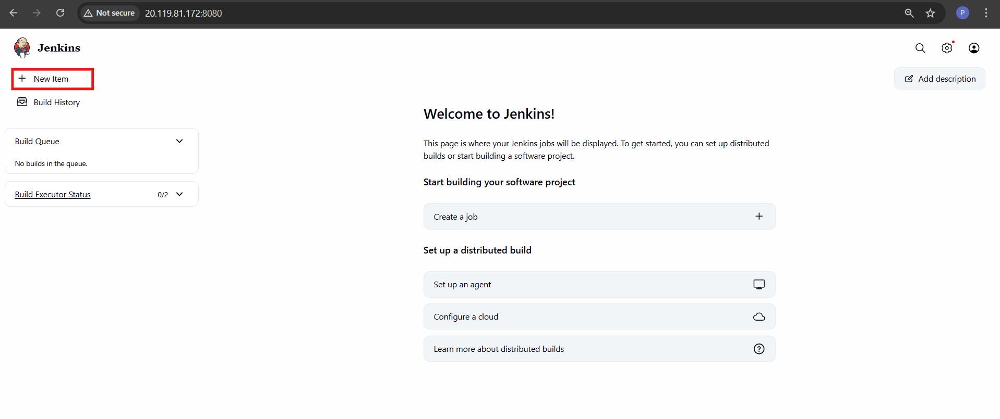
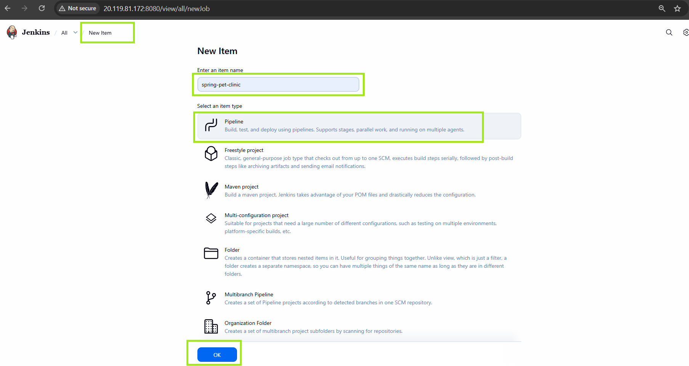
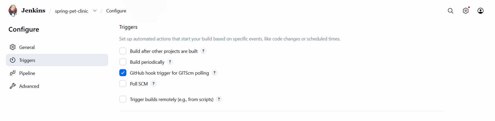
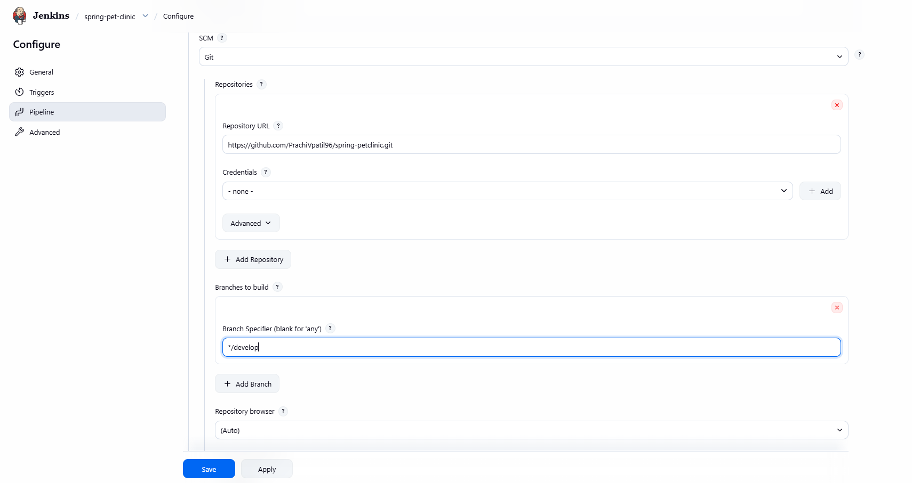
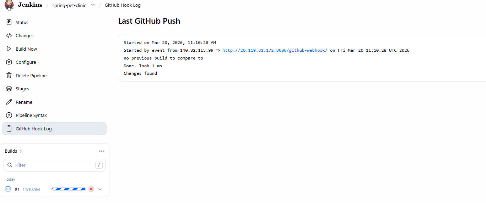
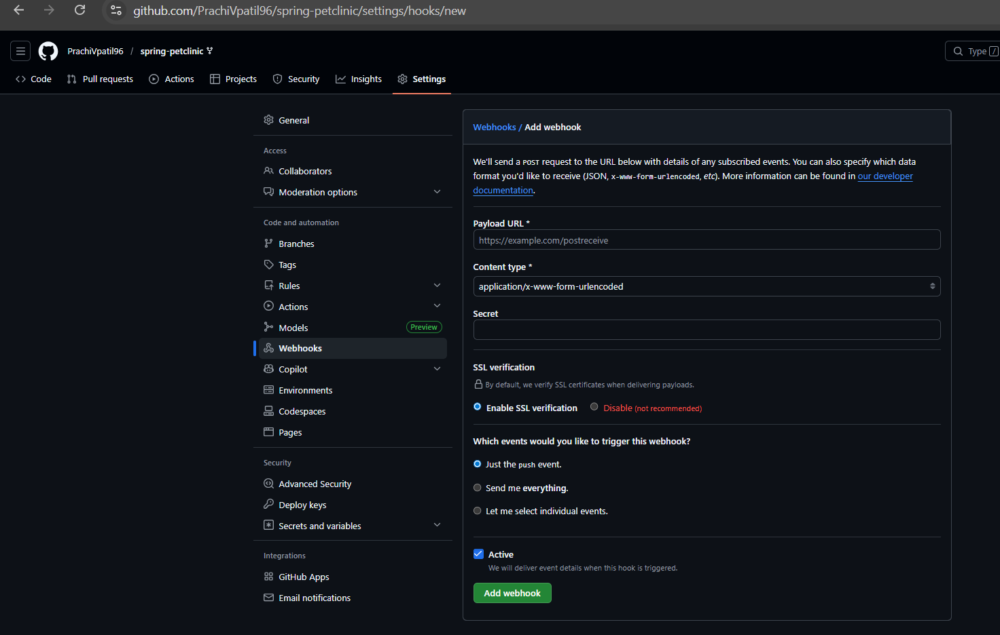
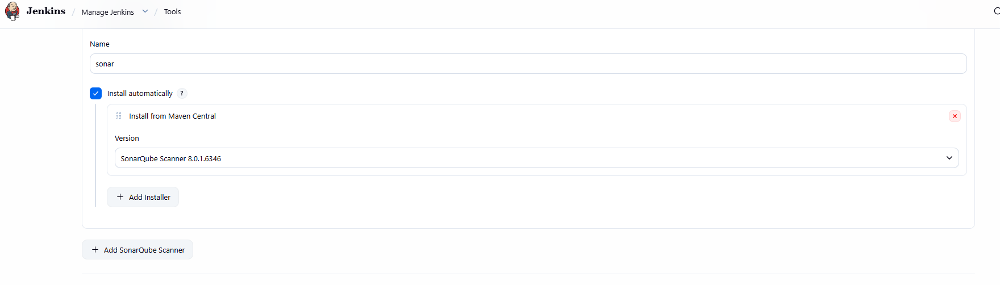
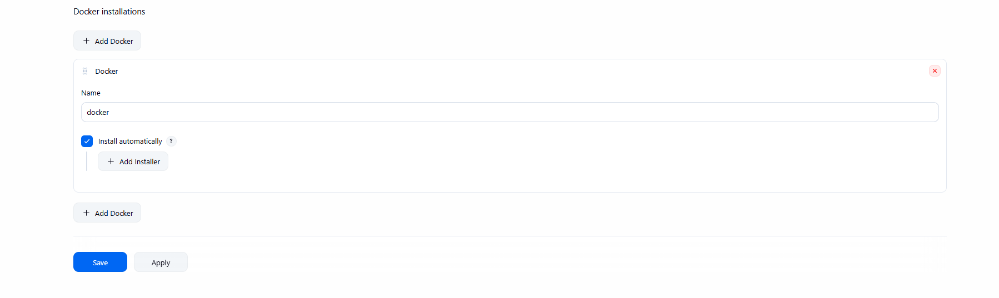
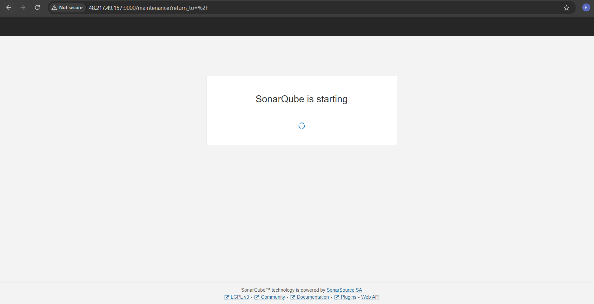
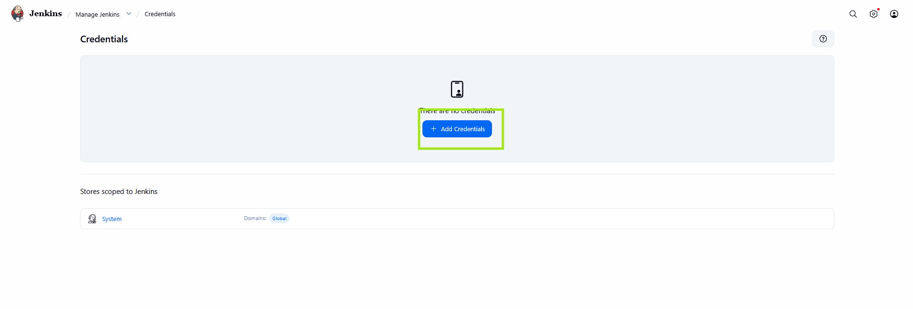

#  End-to-End CI/CD Pipeline using Jenkins, SonarQube, Docker & AWS

##  Project Overview

This project demonstrates a complete CI/CD pipeline for a Java-based application using Jenkins. The pipeline automates code integration, testing, quality checks, containerization, security scanning, and deployment to AWS.

---

##  Tech Stack

* Jenkins (CI/CD)
* GitHub (Source Code Management)
* SonarQube (Code Quality Analysis)
* Docker (Containerization)
* Trivy (Security Scanning)
* AWS EC2 (Deployment)
* Apache Tomcat (WAR Deployment)

---

##  Architecture

```
Developer → GitHub (PR to Main) → Jenkins Pipeline →
Unit Tests → SonarQube → Quality Gate →
Build WAR → Docker Image → Trivy Scan →
Deploy to AWS EC2 → Access via Domain
```

---

##  Repository Structure

```
spring-petclinic/
│── Jenkinsfile
│── Dockerfile
│── pom.xml
│── src/
```

---

## 🔁 CI/CD Pipeline Workflow

### 1.  Trigger

* Pipeline is triggered when a Pull Request (PR) is created to the `main` branch.

---

### 2. 📥 Checkout Code

* Jenkins pulls code from GitHub repository.

---

### 3. 🧪 Run Unit Tests

```bash
mvn test
```

---

### 4. 🔍 SonarQube Analysis

* Code is analyzed using SonarQube.

```bash
mvn sonar:sonar
```

---

### 5.  Quality Gate

* Pipeline stops if code quality fails.

---

### 6.  Build WAR File

```bash
mvn clean package -DskipTests
```

Output:

```
target/*.war
```

---

### 7.  Build Docker Image

```bash
docker build -t spc:latest .
```

---

### 8.  Security Scan (Trivy)

```bash
trivy image spc:latest
```

* Pipeline fails if HIGH/CRITICAL vulnerabilities are found.

---

### 9.  Deployment to AWS EC2

```bash
docker run -d -p 80:8080 --name pet spc:latest
```

---

### 10.  Access Application

```
https://your-domain-name.com
```

---

##  Dockerfile (WAR Deployment)

```
FROM tomcat:9-jdk17

RUN rm -rf /usr/local/tomcat/webapps/*

COPY target/*.war /usr/local/tomcat/webapps/ROOT.war

EXPOSE 8080
```

---

##  Jenkinsfile Overview

Key stages:

* Checkout Code
* Unit Testing
* SonarQube Analysis
* Quality Gate Check
* Build WAR
* Docker Build
* Security Scan
* Deployment

---

##  Webhook Configuration

* Configure GitHub webhook:

```
https://<jenkins-url>/github-webhook/
```

* Trigger events:

  * Pull Requests

---

##  AWS Setup

1. Launch EC2 instance
2. Install Docker:

```bash
sudo apt install docker -y
sudo systemctl start docker
```

3. Open port 80 in security group

---

##  Domain Setup

* Use free domain providers (like Freenom) or AWS Route53
* Map domain → EC2 public IP

---

##  Notifications

* Email notifications configured in Jenkins pipeline
* Alerts triggered on:

  * Build failure
  * Quality gate failure
  * Security issues

---

##  Key Features

* Automated CI/CD pipeline
* PR-based trigger
* Code quality enforcement
* Security scanning
* Dockerized deployment
* Cloud hosting with domain access

---

##  Screenshots (Optional)

*Add screenshots of Jenkins pipeline, SonarQube dashboard, and running app.*












---

##  Learnings

* Implemented end-to-end CI/CD pipeline
* Integrated SonarQube quality gates
* Used Docker for containerization
* Performed vulnerability scanning
* Deployed application on AWS

---

##  Future Improvements

* Kubernetes deployment
* Helm charts
* Auto-scaling
* Monitoring with Prometheus & Grafana

---

##  Author

Prachi Vinod Patil

